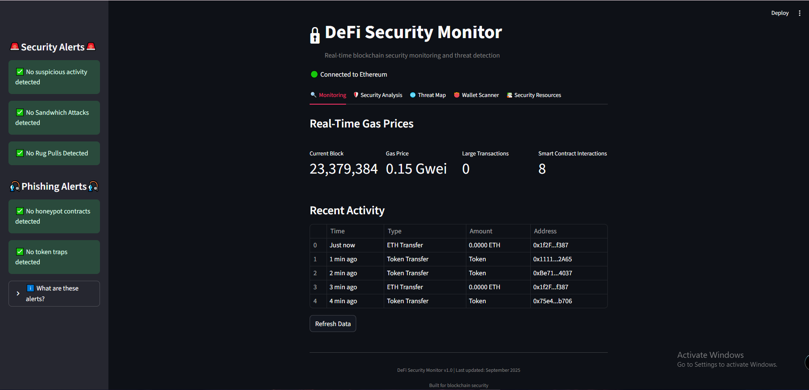

# DeFi Security Monitor



## Overview

DeFi Security Monitor is a real-time blockchain security monitoring system that detects and visualizes potential threats on the Ethereum network. The dashboard provides comprehensive security analysis, threat detection, and educational resources for blockchain security.

## Features

### 🔍 Real-Time Monitoring
- Live Ethereum blockchain connection
- Gas price tracking and visualization
- Smart contract interaction detection
- Large transaction monitoring

### 🛡️ Security Analysis
- Risk scoring system
- Network congestion monitoring
- Transaction volume analysis
- Security metrics dashboard

### 🚨 Threat Detection Algorithms
- High-frequency activity detection
- Sandwich attack identification
- Rug pull early warning system
- Token trap detection
- Honeypot contract alerts

### 🌐 Threat Visualization
- Global threat mapping
- Historical threat patterns
- Known malicious address database integration

### 👛 Wallet Scanner
- Address risk assessment
- Malicious address checking
- Etherscan integration

### 📚 Security Resources
- DeFi security best practices
- Common attack vector explanations
- Security incident case studies
- Interactive security quiz

## Technologies Used

- **Python**: Core programming language
- **Web3.py**: Ethereum blockchain interaction
- **Streamlit**: Dashboard interface and visualization
- **Plotly**: Interactive charts and graphs
- **MyEtherWallet API**: Malicious address database

## Installation

1. Clone the repository:
```bash
git clone https://github.com/jonnyleister23/defi-security-monitor.git
cd defi-security-monitor
