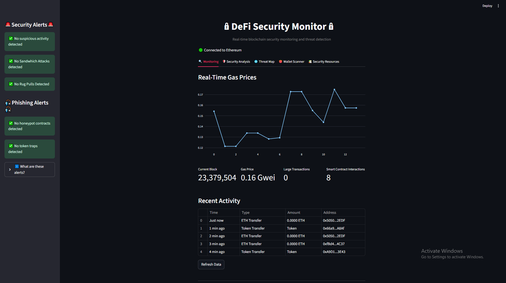

# Monitoring Tab

## Overview
The Monitoring tab provides real-time visibility into Ethereum blockchain activity, displaying key metrics and recent transactions to help detect potential security threats.

## Key Components
1. Connection Status    
🟢 Connected to Ethereum - Active connection to the blockchain    
🔴 Not Connected - Connection issues detected    
3. Real-Time Gas Price Chart
Visualizes gas price fluctuations over time
Helps identify network congestion and potential attack patterns
Stores historical data for trend analysis
4. Key Metrics Panel
Metric	Example	Security Relevance
Current Block	23,384,157	Confirms monitor is synced with blockchain
Gas Price	1.02 Gwei	Indicates network congestion
Large Transactions	1	Flags significant fund movements
Smart Contract Interactions	10	Shows DeFi activity level
5. Recent Activity Table
Displays the most recent blockchain transactions with:
Transaction timing 
Transaction type 
Amount transferred
Recipient address
6. Refresh Button
Allows manual updates of all metrics and transactions for on-demand monitoring.

## Security Applications
Anomaly Detection: Identify unusual gas price spikes or transaction volumes
Transaction Monitoring: Track recent activity for suspicious patterns
Network Health: Monitor gas prices and block progression
Real-time Alerting: Enable quick responses to suspicious activity
The Monitoring tab serves as your real-time window into Ethereum blockchain activity, providing essential data for effective security monitoring.
