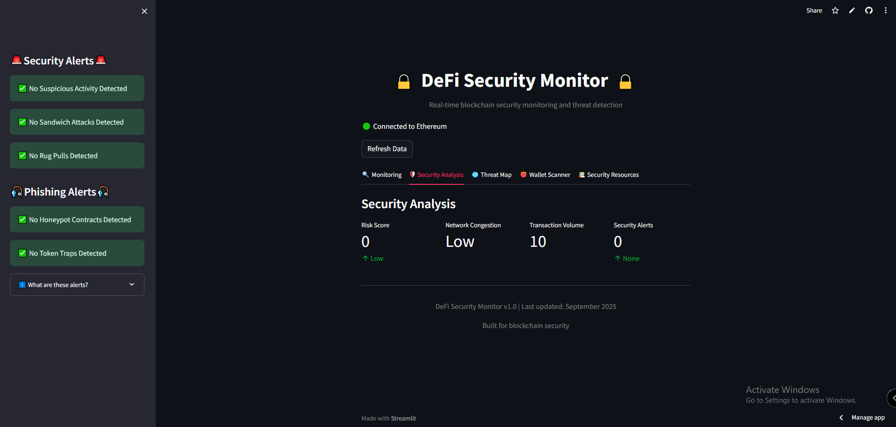

# 🔒 Security Analysis Tab

## 📖 Overview  
The **Security Analysis** tab provides a comprehensive risk assessment of blockchain activity. It highlights key security metrics, threat indicators, and potential vulnerabilities to help identify and respond to attacks.

---

## 📊 Key Components  

### 1. Risk Assessment Metrics  
| **Metric**            | **Value** | **Description** |
|------------------------|-----------|-----------------|
| **Risk Score**         | —         | Aggregate security risk based on detected threats |
| **Network Congestion** | —         | Current network traffic level and gas price assessment |
| **Transaction Volume** | —         | Number of transactions being monitored |
| **Security Alerts**    | —         | Count of active security warnings |

---

### 2. Risk Scoring System  
The **Risk Score** is calculated based on detected threats:  

- **0 points** → No threats detected (**Low Risk**)  
- **1–29 points** → Some threats detected (**Medium Risk**)  
- **30+ points** → Multiple serious threats detected (**High Risk**)  

Each threat type contributes differently:  

| **Threat Type**            | **Points per Instance** |
|-----------------------------|--------------------------|
| High-frequency activity     | 10 points |
| Sandwich attacks            | 15 points |
| Rug pulls                   | 20 points |
| Honeypot contracts          | 5 points  |
| Token traps                 | 15 points |

---

### 3. Network Status Indicators  
**Network Congestion** reflects blockchain load:  

- **Low** → Normal operation  
- **Medium** → Higher than normal activity  
- **High** → Potential network stress or attack  

---

## ⚡ Security Applications  

- **Threat Prioritization:** Quickly identify the most critical security concerns  
- **Risk Quantification:** Convert complex threat data into actionable metrics  
- **Network Health:** Monitor blockchain congestion and activity levels  
- **Trend Analysis:** Track metrics over time to detect recurring patterns  

---
