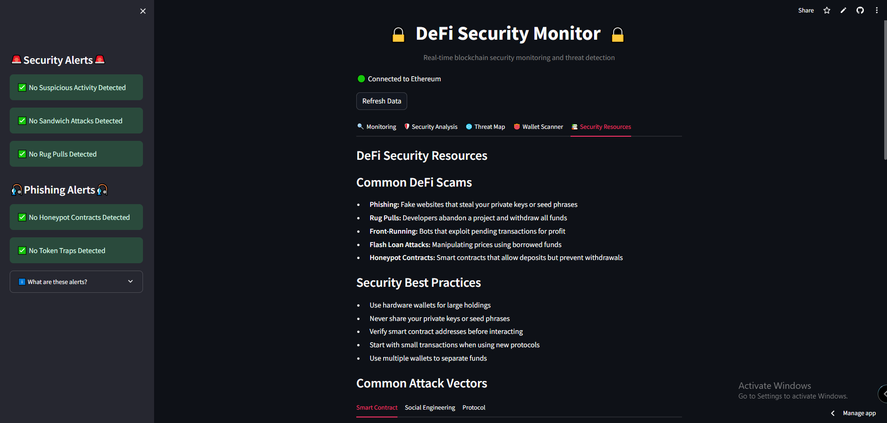

# 📚 Security Resources Tab

## 📖 Overview  
The **Security Resources** tab serves as an **educational hub**, providing comprehensive information about **DeFi security threats, best practices, and protection strategies**.  
Its goal is to help users understand and **mitigate risks** in the blockchain ecosystem.

---

## 📊 Key Components  

### 1. Common DeFi Scams  
A curated list of prevalent scams in the DeFi ecosystem:  

- 🎣 **Phishing:** Fake websites that steal private keys or seed phrases  
- 🏃 **Rug Pulls:** Developers abandon projects after withdrawing all funds  
- ⚡ **Front-Running:** Bots exploit pending transactions for profit  
- 💸 **Flash Loan Attacks:** Manipulating prices using borrowed funds  
- 🪤 **Honeypot Contracts:** Smart contracts that allow deposits but block withdrawals  

---

### 2. Security Best Practices  
Essential guidelines for protecting digital assets:  

- 🔒 Use **hardware wallets** for large holdings  
- ❌ Never share **private keys** or **seed phrases**  
- ✅ Verify **smart contract addresses** before interacting  
- 💵 Start with **small transactions** when using new protocols  
- 👛 Use **multiple wallets** to separate funds  

---

### 3. Common Attack Vectors  

#### 🔹 Smart Contract Vulnerabilities  
- Reentrancy attacks  
- Integer overflow/underflow  
- Access control issues  
- Logic errors  
- Oracle manipulation  

#### 🔹 Social Engineering Attacks  
- Phishing campaigns  
- Impersonation schemes  
- Airdrop scams  
- Fake projects  
- Discord/Telegram hacks  

#### 🔹 Protocol-Level Attacks  
- Flash loan exploits  
- MEV extraction  
- Governance attacks  
- Economic exploits  
- Bridge hacks  

---

### 4. Additional Educational Content  
- 🧾 **Notable DeFi Security Incidents:** Case studies of major hacks  
- ⚡ **Flash Loan Attack Breakdown:** Step-by-step explanation of how these attacks work  
- 🔗 **Useful Resources:** Links to external security tools and guides  
- ✅ **Security Checklist:** Pre-flight checks before using DeFi protocols  
- 🧠 **Interactive Knowledge Quiz:** Test understanding of security concepts  

---

## ⚡ Security Applications  

- **User Education:** Build awareness of common threats and vulnerabilities  
- **Preventative Guidance:** Provide actionable best practices  
- **Threat Understanding:** Explain complex attack vectors in accessible terms  
- **Reference Material:** Serve as an ongoing resource for security information  

---

✅ The **Security Resources tab** transforms complex security concepts into **accessible knowledge**, empowering users to protect themselves in the **high-risk DeFi environment**.  
