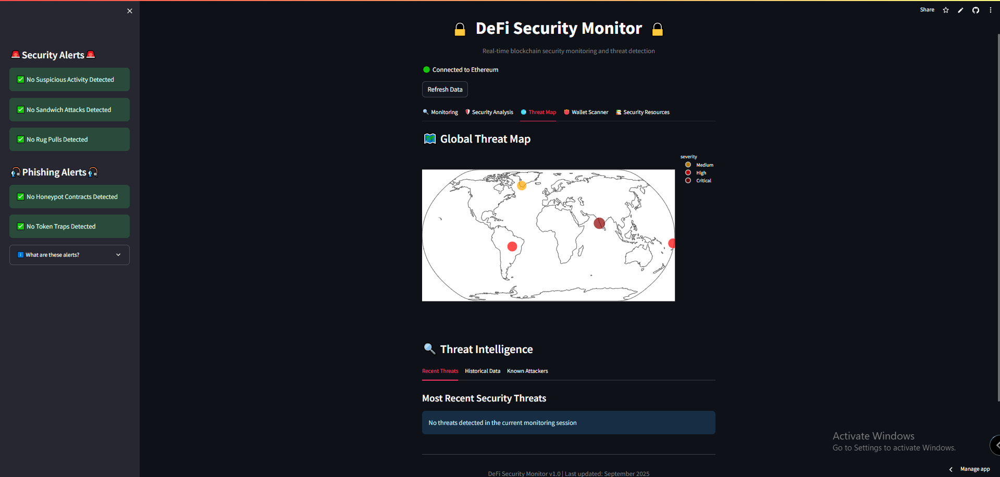

Threat Map Tab

Overview
The Threat Map tab provides a global visualization of blockchain security threats, offering geographical context to detected malicious activities and a comprehensive threat intelligence dashboard.

Key Components
1. Global Threat Map
Interactive world map displaying detected security threats
Color-coded indicators showing threat severity:
Red dots: High severity threats
Orange dots: Medium severity threats
Blue dots: Low severity threats
Geographic distribution of blockchain security incidents
2. Threat Intelligence Panels
The threat intelligence section includes three key tabs:

Recent Threats
Displays the most recently detected security incidents
Shows "No threats detected in the current monitoring session" when clean
When threats are detected, displays:
Threat type (Sandwich Attack, Rug Pull, etc.)
Associated addresses
Risk level
Detection time
Historical Data
Visualizes threat patterns over time
Tracks different threat categories:
High-Frequency Activity
Sandwich Attacks
Rug Pulls
Honeypot Contracts
Token Traps
Known Attackers
Database of identified malicious addresses
Sourced from MyEtherWallet's darklist
Includes address details, comments, and date added
3. Threat Visualization Logic
The map uses a hash-based algorithm to:

Generate consistent coordinates for each unique address
Ensure the same address always appears at the same location
Create a visual pattern of related malicious activities
Security Applications
Geographic Patterns: Identify clusters of related threats
Threat Intelligence: Access comprehensive database of known attackers
Visual Monitoring: Quickly assess the global threat landscape
Historical Context: View how threats evolve over time
The Threat Map tab transforms abstract blockchain addresses into an intuitive visual representation, making it easier to understand the scope and severity of security threats across the DeFi ecosystem.
