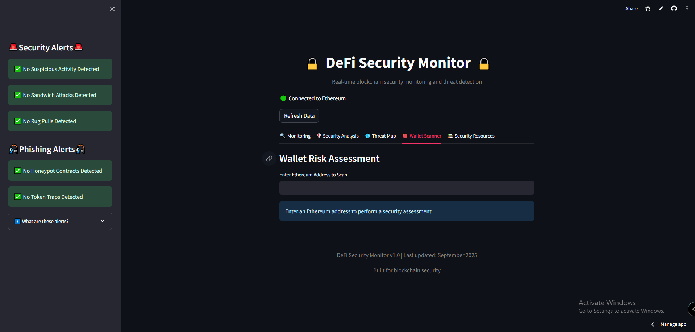

# 👛 Wallet Scanner Tab

## 📖 Overview  
The **Wallet Scanner** tab provides a dedicated tool for assessing the **security risk of individual Ethereum addresses**.  
It allows users to check if specific wallets are associated with **malicious activities or scams** before interacting with them.

---

## 📊 Key Components  

### 1. Address Input Field  
- 📝 Text input box prompting users: *“Enter Ethereum Address to Scan”*  
- ✅ Validation system checks for proper Ethereum address format (42 characters, starting with `0x`)  
- 📌 Clear instructions guide users to enter an address for assessment  

---

### 2. Risk Assessment Engine  
When an address is submitted, the scanner performs multiple checks:  

- ⚠️ Malicious address verification against **MyEtherWallet’s darklist**  
- 🔑 Address format validation to ensure proper Ethereum address structure  
- 📊 Security **risk scoring** based on detected threat indicators  

---

### 3. Assessment Results  

#### 🟢 For Safe Addresses  
- ✅ Success message confirming the wallet scan is complete  
- 🔒 Security status: *No known malicious activity*  
- 🔗 Link to **Etherscan** for detailed transaction history  

#### 🔴 For Malicious Addresses  
- 🚨 Warning alert: **“HIGH RISK WALLET DETECTED!”**  
- 📈 Risk score: **95/100** with *Critical* status  
- 📋 Malicious activity details explaining why the address is flagged  
- ⚠️ Advisory: *“DO NOT send funds to this address!”*  

---

### 4. External Integration  
- 🔗 **Etherscan integration** for direct access to the address’s full on-chain history  
- 🛡️ **Sanitized URL generation** to prevent potential XSS attacks  

---

## ⚡ Security Applications  

- **Pre-transaction Verification:** Check addresses before sending funds  
- **Phishing Protection:** Identify known scam addresses  
- **Due Diligence:** Research new projects or contracts before interaction  
- **Threat Intelligence:** Access a comprehensive database of known malicious actors  

---

✅ The **Wallet Scanner tab** acts as a **crucial security checkpoint**, allowing users to **verify the safety of any Ethereum address** before engaging in transactions or smart contract interactions.  
